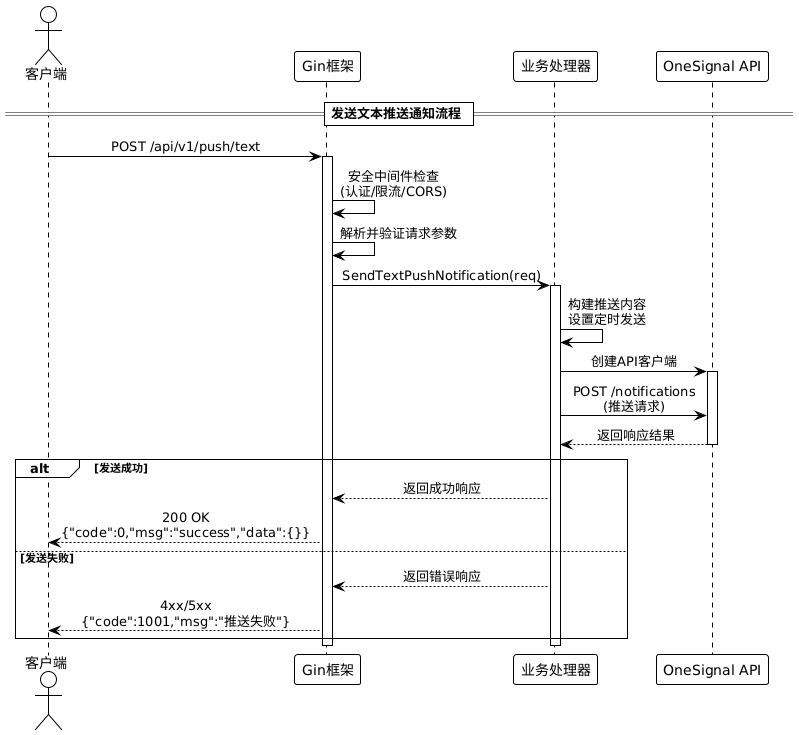

# 推送通知服务

## 项目简介

推送通知服务是一个基于 Go 语言开发的后端服务，用于发送各种类型的推送通知。该服务使用 OneSignal 作为推送服务提供商，支持发送文本通知和文本+图片通知。

## 功能特性

- 支持发送文本推送通知
- 支持发送文本和图片推送通知
- 内置安全中间件，包括：
  - 速率限制
  - 恶意关键词检测（防止 SQL 注入等攻击）
  - 请求体大小限制
  - 安全 HTTP 头部设置
- 自动生成 Swagger API 文档
- 详细的序列图文档
- 公告管理功能
- 分段管理功能

## 技术栈

- **后端框架**：Gin
- **推送服务**：OneSignal
- **API 文档**：Swagger
- **文档工具**：PlantUML
- **语言**：Go
- **数据库**：MongoDB

## 项目结构

```
PushNoification/
├── docs/               # 文档目录
│   ├── docs.go         # Swagger 文档生成文件
│   ├── swagger.json    # Swagger JSON 文档
│   ├── swagger.yaml    # Swagger YAML 文档
│   └── sequence.puml   # 序列图文档
├── out/                # 输出目录
│   └── docs/
│       └── sequence/
│           └── sequence.png  # 序列图图片
├── internal/           # 内部代码
│   ├── api/            # API 相关代码
│   │   ├── handler/    # 请求处理器
│   │   ├── middleware/ # 中间件
│   │   └── routes/     # 路由定义
│   ├── config/         # 配置文件
│   ├── structure/      # 数据结构
│   └── utilities/      # 工具函数
├── main.go             # 主入口文件
├── go.mod              # Go 模块文件
└── README.md           # 项目说明文档
```

## 安装和运行

### 前提条件

- Go 1.18+ 环境
- OneSignal 账号和应用凭据
- MongoDB 数据库

### 安装步骤

1. 克隆项目代码

2. 安装依赖
   ```bash
   go mod tidy
   ```

3. 配置环境变量
   - 设置 OneSignal 应用 ID 和 API Key
   - 设置 MongoDB 连接信息

4. 运行服务
   ```bash
   go run main.go
   ```

### Docker 运行

```bash
docker-compose up -d
```

## API 文档

服务启动后，可以通过以下地址访问 Swagger API 文档：

```
http://localhost:8080/swagger/index.html
```

## API 端点详解

### 推送通知相关 API

#### 1. 发送文本推送通知
- **URL**: `/push/text`
- **方法**: POST
- **标签**: 通知
- **描述**: 发送通用文本推送通知到所有用户。此端点用于发送面向全体用户的通知，如系统公告、重要更新等。警告：请勿使用此端点发送用户特定的通知，因为它会广播给所有用户。

**请求参数**:
```json
{
  "title": "通知标题",
  "message": "通知内容",
  "image_url": "可选的图片URL",
  "segments": ["可选的用户分段数组"],
  "locale": "en",
  "channel": "通知渠道",
  "audit_trail": {
    "pushed_by": "发送者",
    "pushed_at": "2024-01-15T10:00:00Z",
    "via": "发送方式"
  }
}
```

**cURL 示例**:
```bash
curl -X POST http://localhost:8080/push/text \
  -H "Content-Type: application/json" \
  -d '{
    "title": "系统维护通知",
    "message": "系统将于今晚进行维护，预计维护时间2小时",
    "locale": "zh"
  }'
```

**响应示例**:
```json
{
  "status": "success",
  "message": "通知发送成功",
  "data": {
    "id": "通知ID",
    "recipients": 1500
  }
}
```

#### 2. 发送文本和图片推送通知
- **URL**: `/push/text-image`
- **方法**: POST
- **标签**: 通知
- **描述**: 发送包含图片的推送通知到所有用户。此端点用于发送面向全体用户的通知，如系统公告、重要更新等，支持添加图片。

**请求参数**: 同 `/push/text`，但包含 `image_url` 字段

**cURL 示例**:
```bash
curl -X POST http://localhost:8080/push/text-image \
  -H "Content-Type: application/json" \
  -d '{
    "title": "新功能发布",
    "message": "我们很高兴地宣布新功能正式上线！",
    "image_url": "https://example.com/feature-banner.jpg",
    "locale": "zh"
  }'
```

### 公告管理 API

#### 3. 创建新公告
- **URL**: `/announcement/create`
- **方法**: POST
- **标签**: 公告管理
- **描述**: 创建一个新的公告并保存到数据库。公告用于向用户发布重要信息，包括系统维护、活动通知、节假日安排等。

**请求参数**:
```json
{
  "id": "announcement_001",
  "type": "EVENT",
  "message": "系统维护通知：将于本周末进行系统升级维护",
  "priority": "HIGH",
  "created_at": "2024-01-15T10:00:00Z",
  "started_at": "2024-01-20T09:00:00Z",
  "expires_at": "2024-01-21T18:00:00Z"
}
```

**cURL 示例**:
```bash
curl -X POST http://localhost:8080/announcement/create \
  -H "Content-Type: application/json" \
  -d '{
    "id": "maint_20240115",
    "type": "EVENT",
    "message": "系统维护通知：将于本周六进行系统升级维护，预计2小时",
    "priority": "HIGH",
    "started_at": "2024-01-20T02:00:00Z",
    "expires_at": "2024-01-20T04:00:00Z"
  }'
```

#### 4. 删除公告
- **URL**: `/announcement/delete`
- **方法**: DELETE
- **标签**: 公告管理
- **描述**: 根据公告ID从数据库中永久删除指定的公告记录。此操作不可恢复，请谨慎使用。

**请求参数**: `id` (查询参数)

**cURL 示例**:
```bash
curl -X DELETE "http://localhost:8080/announcement/delete?id=maint_20240115"
```

#### 5. 获取最新公告
- **URL**: `/announcement/latest`
- **方法**: GET
- **标签**: 公告管理
- **描述**: 获取系统中最新发布的公告信息。该接口返回按创建时间排序的最新一条公告记录。

**cURL 示例**:
```bash
curl -X GET http://localhost:8080/announcement/latest
```

#### 6. 更新公告
- **URL**: `/announcement/update`
- **方法**: PUT
- **标签**: 公告管理
- **描述**: 根据公告ID更新现有的公告信息。可以修改公告的所有字段，包括类型、内容、优先级和时间信息。

**请求参数**: 
- `id` (查询参数): 公告ID
- 请求体: 完整的公告对象

**cURL 示例**:
```bash
curl -X PUT "http://localhost:8080/announcement/update?id=maint_20240115" \
  -H "Content-Type: application/json" \
  -d '{
    "id": "maint_20240115",
    "type": "EVENT",
    "message": "系统维护时间调整：提前至周五晚上进行",
    "priority": "HIGH",
    "started_at": "2024-01-19T02:00:00Z",
    "expires_at": "2024-01-19T04:00:00Z"
  }'
```

#### 7. 获取所有公告
- **URL**: `/announcement/all`
- **方法**: GET
- **标签**: 公告管理
- **描述**: 获取系统中所有的公告信息，按创建时间降序排序。返回的公告列表包含每个公告的完整信息。

**cURL 示例**:
```bash
curl -X GET http://localhost:8080/announcement/all
```

### 分段管理 API

#### 8. 获取所有分段
- **URL**: `/segment/all`
- **方法**: GET
- **标签**: 分段管理
- **描述**: 获取 OneSignal 中的所有分段信息

**cURL 示例**:
```bash
curl -X GET http://localhost:8080/segment/all
```

## 安全特性

1. **速率限制**：每 IP 每分钟最多 60 个请求
2. **恶意关键词检测**：防止 SQL 注入等攻击
3. **请求体大小限制**：最大 1MB
4. **安全 HTTP 头部**：设置了以下安全头部
   - X-Content-Type-Options: nosniff
   - X-Frame-Options: DENY
   - X-XSS-Protection: 1; mode=block
   - Strict-Transport-Security: max-age=31536000; includeSubDomains

## 序列图

项目包含详细的系统交互序列图，展示了推送通知的完整流程：



序列图文件位于 `docs/sequence.puml`，可以使用 PlantUML 工具查看和编辑。

## Docker 部署

### 开发环境
```bash
# 复制环境文件
cp internal/config/.env.example internal/config/.env
# 编辑 internal/config/.env 填入测试数据
docker-compose up -d
```

### 生产环境
```bash
# 复制环境文件
cp internal/config/.env.example internal/config/.env
# 编辑 internal/config/.env 填入生产数据
docker-compose up -d
```

## 贡献指南

1. Fork 项目
2. 创建特性分支
3. 提交更改
4. 推送到分支
5. 创建 Pull Request

## 许可证

本项目使用 MIT 许可证。详见 LICENSE 文件。